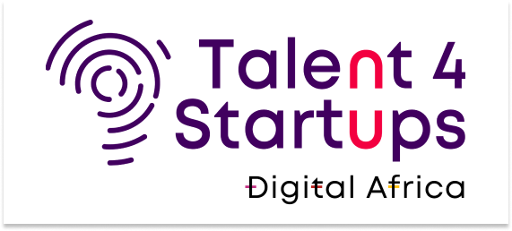

# LyceeDakar
<h1 align = "center">TP EDACY - LYCEE D'EXCELLENCE DAKAR</h1>
<div align = "center">
  
  
</div>

## CONTEXT
have the possibility to add classes in the system. For example: Terminal S1, Terminal S2, Terminal L1a, Terminal L2b. He can also modify or delete any information concerning the classes.
To facilitate enrollment in his school, he would also like to have a part in the application where he can add students and put them in a specific class. For example. He can register his daughter Penda Sarr in Terminal s2.
Finally, for a first version of this platform he will need a part where he can list all the students and classes existing in his school.

## ASSIGNMENT
WORK TO DO :
- Make an Angular page, for the moment no need to put a Backend
- Use Nest JS in the Backend
- Use Graph QL Client with Angular- Put the project on Github
- Add on the Github project, a README file that documents the project
- Share the link of the Github project as an assignment

## EXPLANATIONS
  This angular app contains
  1. a login page to allow only the admin to access the data of the school: For testing purposes, the username and the password are both 'admin'
```
  > usernam: 'admin'
  > password: 'admin'
```
  2. then the admin has access to a list of classes on the left panel and its details on the right. There are buttons at the bottom left of the page if the admin wants to add a class or a student. On the details of each page, the admin can modify the details of the class, as well as the details of the students.
  3. To manipulate data in the app, you have to connect it download/clone the backend app and run it on the same local machine. [Link to backend server app](https://github.com/papabaab/api-lyceedakar-nestjs) which serves simultaneously a GraphQL api & a REST api (see installations)
     
## INSTALLATIONS
1. Clone project
```
git clone https://github.com/papabaab/edacy-lycee-dakar.git
cd edacy-lycee-dakar
npm install
```
2. connect to REST OR GRAPHQL
 - to connect to GraphQL api
    > ng serve --configuration=graphql
 - to connect to Rest api
    > ng serve --configuration=rest

- remarks: the default configuration is the development configuration which serves and connect to the rest api (view angular.json for more informations)

  ## TALENT INFORMATION
  ````
  Name: PAPA AMADOU DIALLO
  email: amadoux12@yahoo.fr
  groupe: N / CODE-CRAFTERS
````

  
